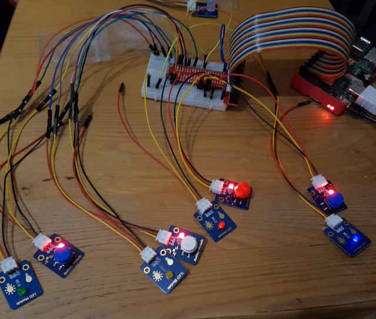

# Electronic Memory
A clone of the simon game build with a Raspberry Pi

---

1. setup up your Raspberry Pi
2. checkout this git repo
3. update the config file, be sure that each Led and Button has a unique Pin
4. start the game with `python3 electronic_memory.py` on your Raspberry Pi 